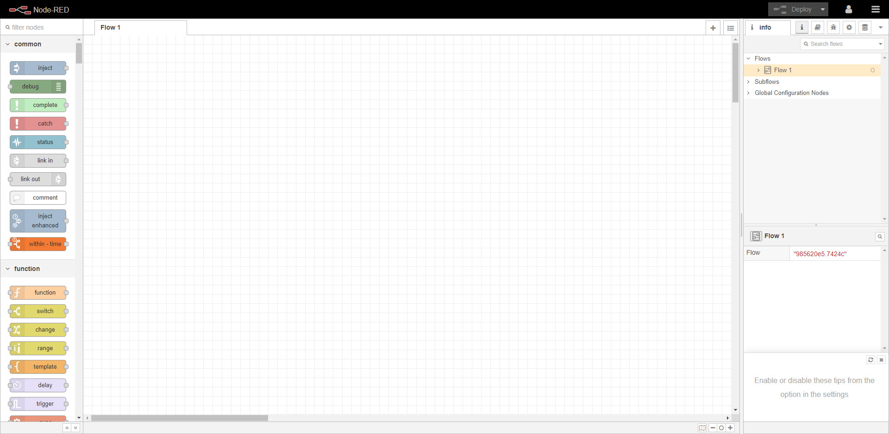

# Useful-NodeRed-Nodes
Useful NodeRed Nodes for RaspberryPi



## Getting Started
I have collected all useful nodes for NodeRed. You can install them using a single command.

## Installing Procedures

first we will need to get into the NodeRed installation folder, execute this command in the terminal.
```
cd ~/.node-red
```
This command above will not work if you are running DeitPi OS, the command down below will work for you instead of the prvious one:
```
cd /mnt/dietpi_userdata/node-red
```
After getting into the NodeRed installation folder, we can now install any nodes we want, just copy this command and execute it in the terminal

```
sudo npm install -i --unsafe-perm moment node-red-contrib-config node-red-contrib-grove node-red-contrib-diode node-red-contrib-bigtimer node-red-contrib-esplogin node-red-contrib-timeout node-red-node-openweathermap node-red-node-google node-red-node-emoncms node-red-node-geofence node-red-contrib-moment node-red-contrib-particle node-red-contrib-web-worldmap node-red-contrib-ramp-thermostat node-red-contrib-graphs node-red-contrib-isonline node-red-node-ping node-red-node-random node-red-node-smooth node-red-node-arduino node-red-contrib-file-function node-red-contrib-boolean-logic node-red-contrib-blynk-ws node-red-contrib-chatbot node-red-dashboard node-red-node-darksky node-red-contrib-owntracks node-red-contrib-alexa-local node-red-contrib-heater-controller node-red-node-sqlite node-red-contrib-sqldbs node-red-node-mysql node-red-contrib-camerapi node-red-contrib-mjpgcamera node-red-contrib-python-function node-red-contrib-python3-function node-red-contrib-pythonshell node-red-contrib-ip node-red-node-dropbox node-red-node-watson node-red-contrib-advanced-ping node-red-contrib-fs-ops node-red-contrib-influxdb node-red-contrib-home-assistant-websocket node-red-contrib-ibm-watson-iot node-red-contrib-sun-position node-red-contrib-tuya-local node-red-contrib-ui-led node-red-contrib-yr node-red-contrib-aedes node-red-contrib-npm node-red-contrib-telegrambot node-red-contrib-dsm node-red-contrib-ftp node-red-contrib-amazon-echo node-red-contrib-alexa-notifyme node-red-contrib-tcp-client node-red-contrib-aedes node-red-contrib-modbustcp node-red-contrib-pcf8574-lcd node-red-contrib-git-nodes node-red-contrib-git-backup node-red-node-redis node-red-contrib-loop node-red-contrib-loop-processing node-red-contrib-looptimer node-red-contrib-looptimer-advanced
```

The Nodes that will be installed:
```
node-red-contrib-config
node-red-contrib-grove
node-red-contrib-diode
node-red-contrib-bigtimer
node-red-contrib-esplogin
node-red-contrib-timeout
node-red-node-openweathermap
node-red-node-google
node-red-node-emoncms
node-red-node-geofence
node-red-contrib-moment
node-red-contrib-particle
node-red-contrib-web-worldmap
node-red-contrib-ramp-thermostat
node-red-contrib-graphs
node-red-contrib-isonline
node-red-node-ping
node-red-node-random
node-red-node-smooth
node-red-node-arduino
node-red-contrib-file-function
node-red-contrib-boolean-logic
node-red-contrib-blynk-ws
node-red-contrib-chatbot
node-red-dashboard
node-red-node-darksky
node-red-contrib-owntracks
node-red-contrib-alexa-local
node-red-contrib-heater-controller
node-red-node-sqlite
node-red-contrib-sqldbs
node-red-node-mysql
node-red-contrib-camerapi
node-red-contrib-mjpgcamera
node-red-contrib-python-function
node-red-contrib-python3-function
node-red-contrib-pythonshell
node-red-contrib-ip
node-red-node-dropbox
node-red-node-watson
node-red-contrib-advanced-ping
node-red-contrib-fs-ops
node-red-contrib-influxdb
node-red-contrib-home-assistant-websocket
node-red-contrib-ibm-watson-iot
node-red-contrib-sun-position
node-red-contrib-tuya-local
node-red-contrib-ui-led
node-red-contrib-yr
node-red-contrib-aedes
node-red-contrib-npm
node-red-contrib-telegrambot
node-red-contrib-dsm
node-red-contrib-ftp
node-red-contrib-amazon-echo
node-red-contrib-alexa-notifyme
node-red-contrib-tcp-client
node-red-contrib-aedes
node-red-contrib-modbustcp
node-red-contrib-pcf8574-lcd
node-red-contrib-git-nodes
node-red-contrib-git-backup
node-red-node-redis
node-red-contrib-loop
node-red-contrib-loop-processing
node-red-contrib-looptimer
node-red-contrib-looptimer-advanced
```
